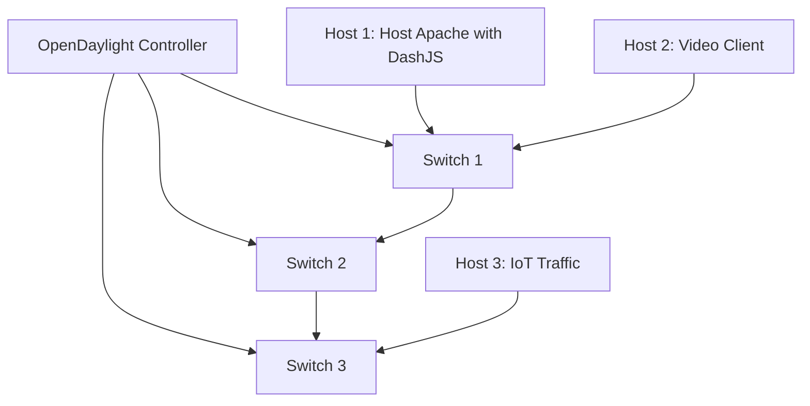

```mermaid
graph TD
    ODL["OpenDaylight Controller"]

    ODL --> S1

    S1["Switch 1"]
    S2["Switch 2"]
    S3["Switch 3"]
    H1["Host 1: Host Apache with DashJS"]
    H2["Host 2: Video Client"]
    H3["Host 3: IoT Traffic"]

    ODL --> S2
    ODL --> S3

    S1 --> S2
    S2 --> S3

    H1 --> S1
    H2 --> S1
    H3 --> S3
```