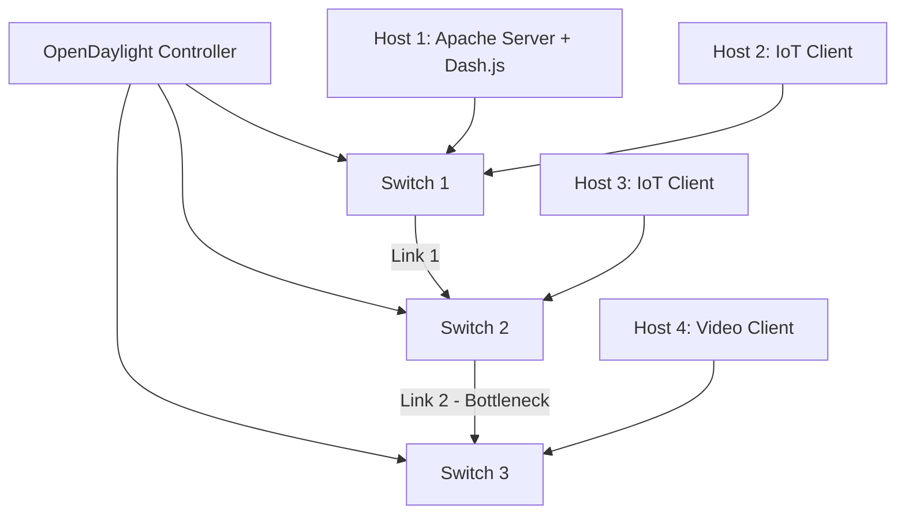

```mermaid
graph TD
    ODL["OpenDaylight Controller"]
    S1["Switch 1"]
    S2["Switch 2"]
    S3["Switch 3"]
    H1["Host 1: Apache Server + Dash.js"]
    H2["Host 2: IoT Client"]
    H3["Host 3: IoT Client"]
    H4["Host 4: Video Client"]

    ODL --> S1
    ODL --> S2
    ODL --> S3

    S1 -->|Link 1| S2
    S2 -->|Link 2 - Bottleneck| S3

    H1 --> S1
    H2 --> S1
    H3 --> S2
    H4 --> S3
```